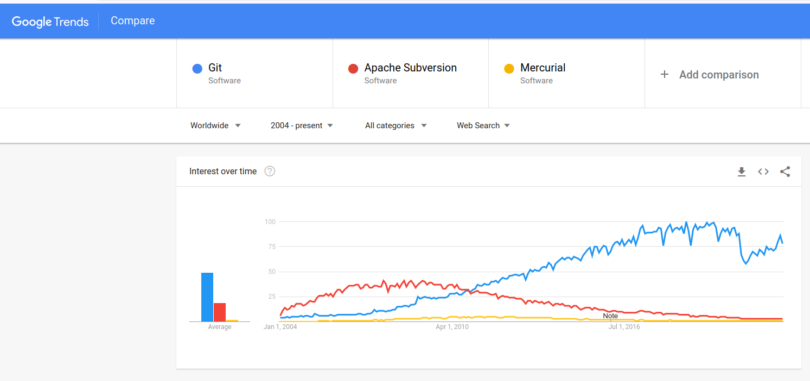

# Gitとは
Gitは **バージョン管理システム（Version Control System; VCS）** の1つで、ディレクトリ内のすべてのファイルの履歴を保存するためのソフトウェア。

# VCSの目的
## VCSを使わない場合
### 1.
たとえばまず `main.c` というファイルを作って以下のように書いたとする。
```cpp
#include <stdio.h>
#include <stdlib.h>

// ゼロ除算をチェックして割り算する関数
int my_div(int a, int b) {
    if (b == 0) {
        fprintf(stderr, "Zero division error\\n");
        exit(1);
    }
    return a / b;
}

int main(void) {
    // 20 / 4 の結果を表示する
    printf("%d\\n", my_div(20, 4));
    return 0;
}
```

### 2.
次に、4でしか割らないからゼロ除算のチェックは不要であったことに気づき、my_div関数を消したとする。
```cpp
#include <stdio.h>

int main(void) {
    // 20 / 4 の結果を表示する
    printf("%d\\n", 20 / 4);
    return 0;
}
```

### 3.
その数日後、割る数にargcを使うようにしたいと思い、以下のようにプログラムを修正したとする。
```cpp
#include <stdio.h>

int main(int argc) {
    // 20 / (argc - 1) の結果を表示する（argcはプログラムに渡された引数の個数）
    printf("%d\\n", 20 / (argc - 1));
    return 0;
}
```

ここでargcが1だとエラーになるから、 **1.** で作った `my_div` 関数がほしい！でももう上書き保存してしまってもう一度書くしかない！となる。

### 4.
次から、この人はプログラムに変更を加えるたびに **日付** （または連番）をつけて保存するようになる...
```bash
MyProject/
    main.c             # 最新バージョン
    main_20190405_1.c  # 2019年4月5日(1)
    main_20190405_2.c  # 2019年4月5日(2)
    main_20190405_3.c  # 2019年4月5日(3)
    main_20190406.c    # 2019年4月6日
    main_20190408.c
    main_20190520_1.c
    main_20190520_2.c
    ...
```

## VCSを使う場合
### 1.
まずターミナルで `git init` を打ってから作業を開始する。
このコマンドはカレントディレクトリに `.git` という名前のフォルダを生成する。既に `.git` フォルダがあるなら実行しなくてよい。

```shell
$ git init
Initialized empty Git repository in /home/foo/bar/.git/
```

### 2.
main.cを作って **git add** → **git commit**\
`-m "コミットメッセージ"` はコミットにつけるメッセージの指定で、あとで見返した時に何の変更をしたのかがすぐに分かるようにするためのもの。（必須）

```cpp
#include <stdio.h>
#include <stdlib.h>

// ゼロ除算をチェックして割り算する関数
int my_div(int a, int b) {
    if (b == 0) {
        fprintf(stderr, "Zero division error\\n");
        exit(1);
    }
    return a / b;
}

int main(void) {
    // 20 / 4 の結果を表示する
    printf("%d\\n", my_div(20, 4));
    return 0;
}
```

```shell
$ git add .
$ git commit -m "initial commit"
[master (root-commit) 7d7d553] initial commit
 1 files changed, 18 insertions(+)
 create mode 100644 main.c
```

ターミナル（or コマンドプロンプト）のカレントディレクトリ下に複数のファイルがある場合は、それらすべてが保存される。
1つのファイルだけを保存したい場合は、`git add .` を `git add <ファイル名>` に変更する。

#### 補足1
初回に限り、`Author identity unknown` と表示される。`git config user.name <名前>` と `git config user.email <メールアドレス>` を実行してコミットに紐付けるユーザー名を指定する必要がある。
名前とメールアドレスの部分は何でもよく、`git config user.name a` `git config user.email a` でも良い。ただ、共同作業するときに誰が作業したのかがわかるように、名前にはグループ内で個人を特定できる名前を使うと良い。メールアドレスに本当のアドレスを設定するのは、コミットをインターネット上に公開したときにスパムが飛んでくる可能性があり、メリットが無いため推奨しない。

#### 補足2
`git commit` は `git init` コマンドで生成された `.git/` フォルダに `git add` で指定されたファイルすべてを保存するコマンド。逆に、一度作ったgitレポジトリを消したいときは単純に `.git/` フォルダを消せば良い。

### 3.
main.cを編集して **git add** → **git commit**
```c
#include <stdio.h>

int main(void) {
    // 20 / 4 の結果を表示する
    printf("%d\\n", 20 / 4);
    return 0;
}
```

```shell
$ git add .
$ git commit -m "div関数を削除"
[master bd23c17] div関数を削除
    1 files changed, 1 insertion(+), 12 deletions(-)
```

### 4.
ここで、 **3.** で上書き保存して消えたmy_div関数をgitの履歴から取り出すために、 **2.の時点でのディレクトリの状態を復元する**
```shell
$ # コミットのリストを表示。HEADが現在のディレクトリの状態，
$ # bd23c17と7d7d553はそれぞれのコミットのID
$ git log --oneline
bd23c17 (HEAD -> master) div関数を削除
7d7d553 initial commit

$ # IDが7d7d553のコミットの状態へディレクトリを復元する
$ git checkout 7d7d553
Note: checking out '7d7d553'.
...
```

テキストエディタでmain.cを開くと、my_div関数が存在する。
```c
#include <stdio.h>
#include <stdlib.h>

// ゼロ除算をチェックして割り算する関数
int my_div(int a, int b) {
    if (b == 0) {
        fprintf(stderr, "Zero division error\\n");
        exit(1);
    }
    return a / b;
}

int main(void) {
    // 20 / 4 の結果を表示する
    printf("%d\\n", my_div(20, 4));
    return 0;
}
```

復元したmy_div関数をコピーできたら、最新の状態（my_div関数を消した後の状態）に戻る必要がある。そのためには以下のコマンドを打つ。（gitのインストール時の設定によってはmasterではなくmainのこともあります。）
```shell
$ # 最新の状態へ戻る
$ git checkout master
```

### 補足
単に特定のコミットの時点でのファイルを閲覧するだけなら `git show` コマンドを使えば良い。
```shell
$ git show 7d7d553:main.c
... ここにファイルの内容が出力される
```

## なぜファイルに日付を付けて保存していくのでは駄目なのか
1. VCSを使うと、変更が圧縮されて保存される (*1)
2. 保存対象からディレクトリ内の一部のファイル（コンパイル後の **実行可能ファイル** など）を自動で除くことができる
   - gitであれば .gitignore や .git/info/exclude に除外したいファイル名を書く。
3. ファイル数が増えないため、ディレクトリが散乱しない
4. 各コミットで何を変更したのかを **コミットメッセージ** で確認できる
5. 誰が変更したのか、いつ変更されたのかが分かる
6. 複数人での履歴の共有が容易（後述）
7. 使ってないと時代遅れ

*1: 保存されたデータの総量が一定以下のときは圧縮されない。

## 履歴はどこに保存されるのか
`git init` コマンドを打ったディレクトリに生成される  `.git`  というフォルダの中に保存されている。

## 以上の内容の動画
<video src="./assets/git-tutorial1.mp4" controls style="width: 60%"></video>

## コマンドを覚えられない
[GitHub Desktop](https://desktop.github.com/) , [GitKraken](https://www.gitkraken.com/), [SourceTree](https://www.sourcetreeapp.com/), [Fork](https://git-fork.com/) 等のGUIを使うと良い。

それぞれの比較 （**2020年らへんに調べた情報のため今は違うかも**）:
- [GitHub Desktop](https://desktop.github.com/): 使うのが **一番簡単** だが機能が少ない。
- [GitKraken](https://www.gitkraken.com/): 機能が多いが、初心者には少し難しいかもしれない。有料。
- [SourceTree](https://www.sourcetreeapp.com/): GitKrakenと比べると操作が直感的ではない。
- [Fork](https://git-fork.com/): 使ったことがないが、良いと聞く。

## 他のVCSは？
Gitは **2005年** に登場した比較的新しいVCS。以前は主に **subversion** が使われていた。



## GitHubとの違いは？
gitはバージョン管理システム。GitHubはgitの履歴を複数人で共有するためのクラウドストレージ。

競合としてGitLabやGitBucketなどがある他、自分でサーバーを用意することもできる。

# Gitを使った共同編集
- GitHub の理解のために、gitをいますぐには共同作業に使う予定が無い人も読むことを勧めます。

## bare git repository
複数のgitレポジトリ（ `git init` を実行したディレクトリ）を同期するには、 **bare git repository** が必要。bare git repositoryは `git init --bare` で作成できる。\
> 注意: `--bare` が無い場合の `git init` と異なり、`git init --bare` はカレントディレクトリに直接複数のファイルを生成するため、新しく空のディレクトリを作り、そこへ `cd` してから実行すると良い。

`git remote add <任意の名前> <urlやファイルパスなど>` で同期に使うbare git repositoryを追加できる。ここで追加したレポジトリを **リモートレポジトリ** という。 `git remote -v` で今までに追加したリモートレポジトリのリストを表示できる。なお、リモートではない（ `--bare` をつけずに初期化した）レポジトリは **ローカルレポジトリ** という。

`git push <リモートレポジトリに付けた名前> master` でリモートレポジトリへファイルの変更履歴を送信できる。 `git pull <リモートレポジトリに付けた名前> master` でリモートレポジトリにあるファイルの変更履歴を受信できる。

以下の動画ではそれを試している。左の段がローカルレポジトリ1、真ん中の段がリモートレポジトリ、右の段がローカルレポジトリ2。動画では、各ローカルレポジトリを異なるユーザーが使用すると想定して、user1, user2と名付けている。\
まず左の段のローカルレポジトリから右の段のレポジトリへgitの履歴を送り、次に逆方向も試している。\
`git push` を実行したときに中段のVSCode上のファイルに変化があることが分かる。\
なお、今回はbareレポジトリのディレクトリ名をremote-serverという名前にしたが、実際のプロジェクトでは慣習として.gitで終わる名前をつけることが多い。（例: remote-server.git）

<video src="./assets/git-tutorial2.mp4" controls style="width: 60%"></video>

### 補足
一度 `git remote add` 設定したリモートレポジトリを消すには `git remote rm <リモートレポジトリの名前>` を使う。

## Gitホスティングサービス
複数人で作業する場合は、 **リモートレポジトリ** が各ユーザーからアクセスできる場所（インターネット上）にないといけない。git bare repository を作って、自分で用意したSSH等からアクセスできるサーバ上に置いても良いが、サーバの管理が必要になり面倒。そこで、**Gitホスティングサービス** がよく利用される。 **GitHub** はGitホスティングサービスのうちのひとつ。

たとえばGitHubで新しくレポジトリを作成すると、このように表示される。※レポジトリ名は加工してfoo/fooに変更しました\
なお、 `git push -u` の `-u` は[上流ブランチ](https://git-scm.com/book/ja/v2/Git-のブランチ機能-リモートブランチ#r_tracking_branches)の設定を行うオプションで、 `git pull` での省略記法を可能にする役割がある。


## git clone
リモートレポジトリのデータをローカルレポジトリにもってくる作業は、以上のように `git remote add` と `git pull` でやっても良いが、 `git clone` を使うと簡単にできる。

たとえば https://github.com/githubtraining/hellogitworld をダウンロードしたい場合は次のコマンドを実行すると、`mkdir hellogitworld && cd hellogitworld && git remote add origin https://github.com/githubtraining/hellogitworld.git && git pull` に相当する処理を実行してくれる。

```shell
git clone https://github.com/githubtraining/hellogitworld.git
```

### 補足
GitHubの場合、urlの `.git` は省略できて、`git clone https://github.com/githubtraining/hellogitworld` でも良い。

# コンフリクト
## コンフリクトと対処方法
複数人で同じファイルに同時に変更を加えると、 **コンフリクト** が発生する。（下図を参照。text: xxxはファイルの中身がxxxであることを表す。）\


コンフリクトが起きると `git push` が実行できなくなる。そうなったら、一度 `git pull` を行った後にコンフリクトを解消してコミットし、もう一度 `git push` すればよい。（以下の動画を参照）

<video src="./assets/conflict.mp4" controls style="width: 60%"></video>

# 次に読むべきもの
以上を理解したら、次にこのサイトを読んで、git clone、ステージング、ブランチの管理などを学んでください。日本語訳もあります。\
https://rogerdudler.github.io/git-guide/

次にこのゲームで refやcherry-pick などについて学んでください。\
https://learngitbranching.js.org/

次に何らかの資料で.gitignoreの文法について学んでください。そんなに難しくないので、どの資料で学んでも同じだと思います。詳しく知りたいなら: https://git-scm.com/docs/gitignore

次に https://www.youtube.com/watch?v=rgbCcBNZcdQ か https://opensource.com/article/19/7/create-pull-request-github でGitHubの Pull Request の使い方を学んでください。

それを読み終わってまだ余裕があるなら、次に [Pro Git](https://git-scm.com/book/en/v2) を読んでください。これも日本語訳があります。
